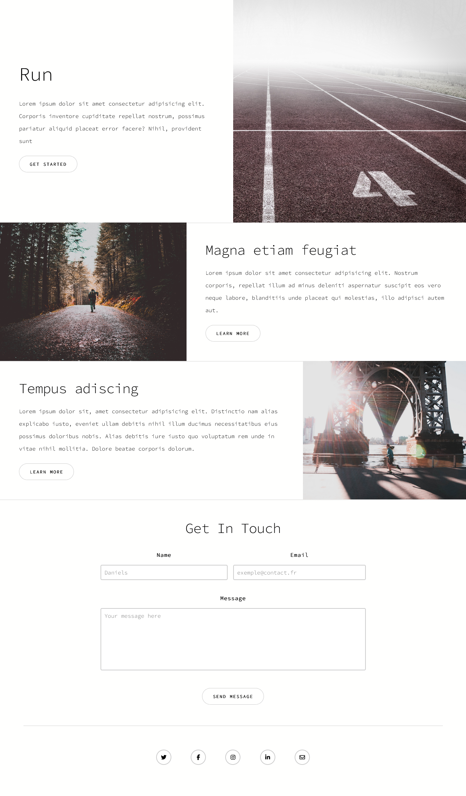
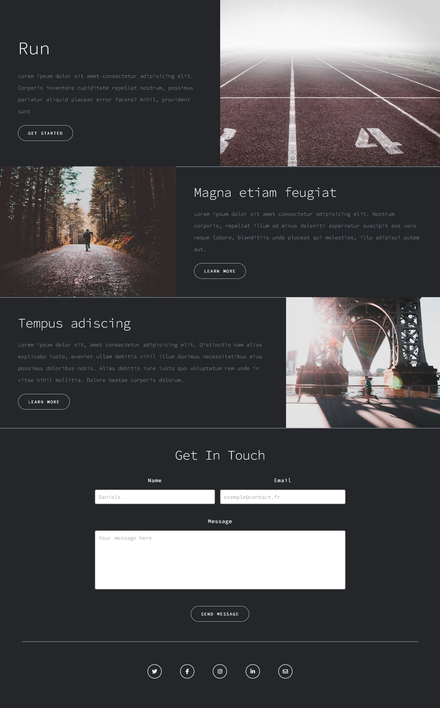

## PROJET RUN

MODE CLAIR :

MODE NUIT :

## Le challenge

Création du projet Run en HTML5, CSS et JavaScript avec la mise en place d'un mode light et dark (@media(prefers-colors-scheme)), une apparition des sections du site en fonction du scroll sur la page et la validation du formulaire (mise enplace de regex...)

## Démonstration

Lien vers le projet : https://aperbet56.github.io/run_project/

## Projet développé avec

- Utilisation des balises sémantiques HTML5
- CSS3
- Flexbox
- Grid
- Animation css (transition)
- Page web responsive
- Desktop first
- Utilisation d'un normaliseur : le fichier normalize.css
- Importation de la police "Source Sans Pro"
- Commentaires HTML
- Commentaires CSS
- Mise en place d'un mode light et dark via @media (prefers-color-scheme)
- JavaScript
- Code JavaScript commenté
- Condition if...else
